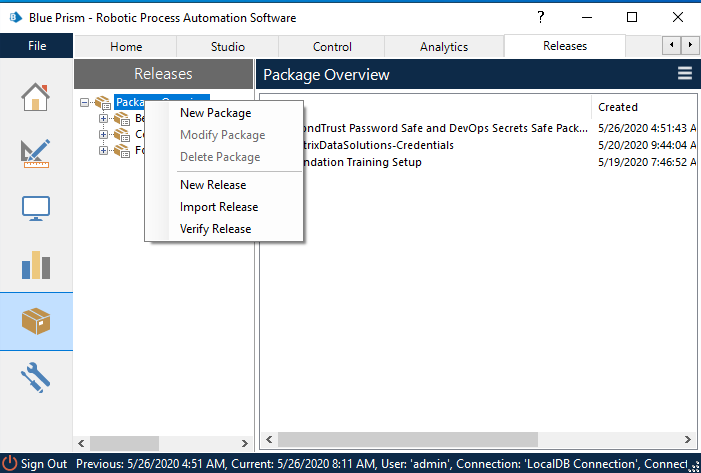
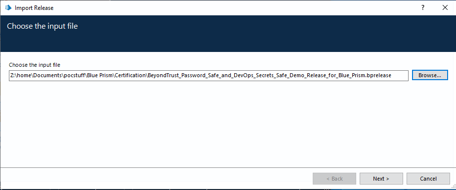
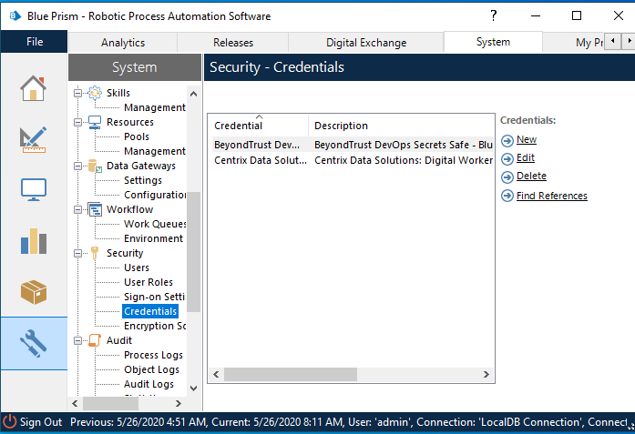
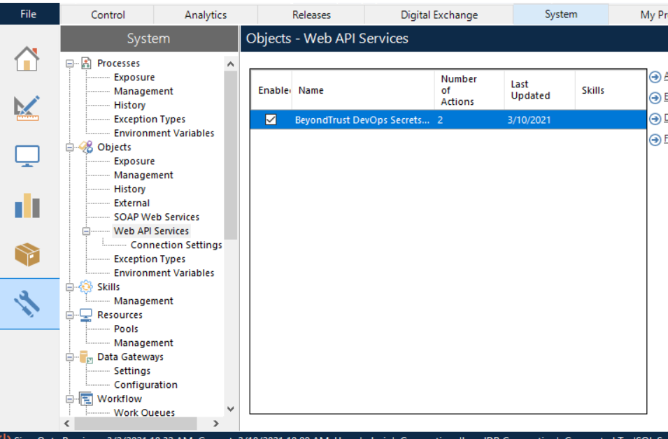
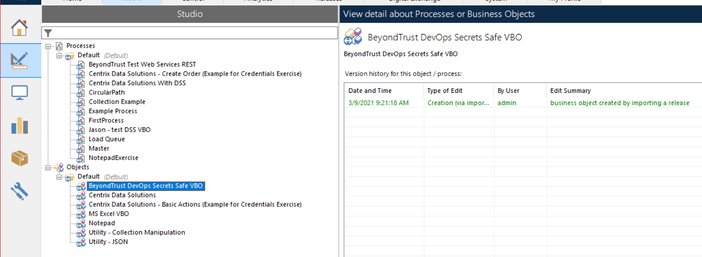
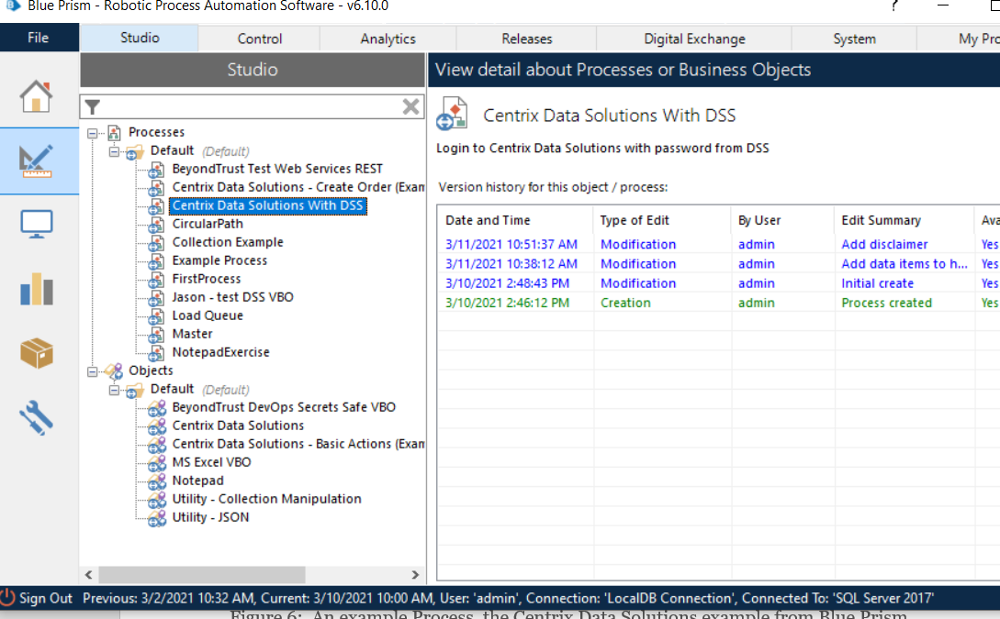
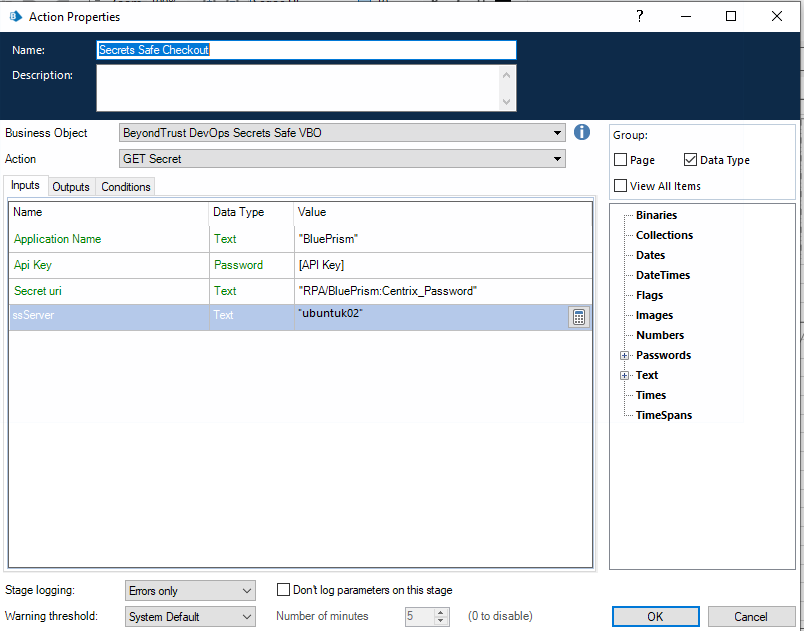
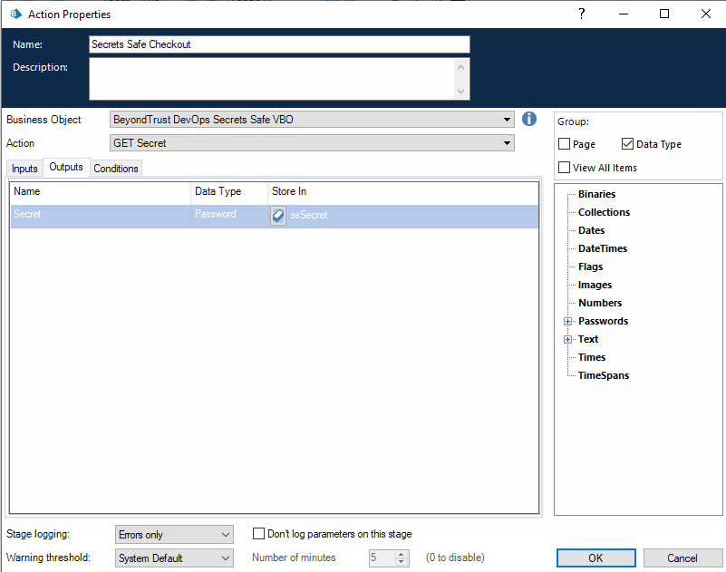

How to install and use the BeyondTrust DSS VBO

Integration for Blue Prism

This guide covers DevOps Secrets Safe VBO.

**Please Note**:

The release does include a sample process that uses the DSS VBO with the "Centrix Data Solutions" sample application used for Blue Prism training. To run this sample process you will need to point the Centrix Data Solutions VBO to a path to the Centrix executable on your system. The Centrix Data Solutions executable is available from [Blue Prism University](https://university.blueprism.com/).

# Step-by-step installation and configuration

Importing the release

Figure 1: Select Import Release
by right-clicking on Package Overview

>   

Figure 2: Navigate to the location of the .brelease file and follow the steps.

>   

Figure 3: Once imported, you will see a Credential Object for DevOps Secrets
Safe inside which you will need to store the API Key for the Blue Prism
application.

Figure 4: You will also find a generic Web API Service for DevOps Secrets Safe.

Figure 5: You will find the Beyondtrust Devops Secrets Safe VBO under objects

Figure 6: An example Process,
“Centrix Data Solutions With DSS” uses the Centrix Data Solutions example from
Blue Prism tutorial, together with an associated VBO, is also included to
demonstrate how to use the BeyondTrust Devops Secrets Safe VBO.

Figure 7: The VBO Object for
DevOps Secrets Safe Inputs tab.

Application Name: The name of the application as created and authorized in DSS.

Api Key: Generated by DSS when application for Blue Prism is created, stored in
Blue Prism Credential object.

Secret uri: The Secret that contains the password we want to Check-Out

ssServer: The DNS resolvable server name for DSS.

Refer to the DevOps Secrets Safe user guide in order to authorize the Application to read the intended secret.

Figure 8: DSS VBO Outputs tab.

The single Output parameter is the returned password, that must be stored in
Password Data item.

HTTP errors will be returned if an error is encountered:

For Authentication, 200 is successful, 400 is Invalid Request, 401 is failed to
authenticate, and 403 means that the system is sealed and must be unsealed or DSS has rejected the request due to a safelist denial.

For Check-out, 200 is Success, 401 means that the user is not authorized, 403
the System is sealed, and 404 means that the secret or scope is not found.
